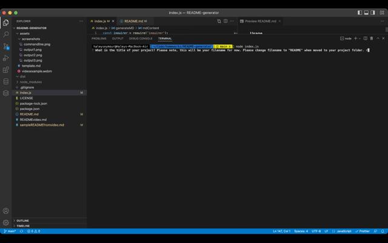

# **README Generator**

## **Table of Contents**
---
  - [License](#license)
  - [Installation](#installation)
  - [Packages](#packages)
  - [Description](#description)
  - [Usage](#usage)
  - [Screenshots](#screenshots)
  - [Contributing](#contributing)
  - [Tests](#tests)
  - [Questions?](#questions)

 

### **License** 
---
[MIT License](./LICENSE)  

Copyright (c) 2022 Haley Seymour

Permission is hereby granted, free of charge, to any person obtaining a copy
of this software and associated documentation files (the "Software"), to deal
in the Software without restriction, including without limitation the rights
to use, copy, modify, merge, publish, distribute, sublicense, and/or sell
copies of the Software, and to permit persons to whom the Software is
furnished to do so, subject to the following conditions:

The above copyright notice and this permission notice shall be included in all
copies or substantial portions of the Software.

THE SOFTWARE IS PROVIDED "AS IS", WITHOUT WARRANTY OF ANY KIND, EXPRESS OR
IMPLIED, INCLUDING BUT NOT LIMITED TO THE WARRANTIES OF MERCHANTABILITY,
FITNESS FOR A PARTICULAR PURPOSE AND NONINFRINGEMENT. IN NO EVENT SHALL THE
AUTHORS OR COPYRIGHT HOLDERS BE LIABLE FOR ANY CLAIM, DAMAGES OR OTHER
LIABILITY, WHETHER IN AN ACTION OF CONTRACT, TORT OR OTHERWISE, ARISING FROM,
OUT OF OR IN CONNECTION WITH THE SOFTWARE OR THE USE OR OTHER DEALINGS IN THE
SOFTWARE.
  

 

### **Installation** 
---
To install this project: 
1. Start by forking this repository on Github. 
2. Clone this project to your machine by using the "git clone + URL" command. 
3. Open the project with your favorite text editor, like VS Code (in your terminal, first type "cd foldername" then "code ."). 
4. Install Node.js from their website, if you have not already. Here are some additional [instructions](https://coding-boot-camp.github.io/full-stack/nodejs/how-to-install-nodejs).
5. This project includes a package.json file that specifies dependencies for this project, so be sure to run "npm install". This will install the packages specified in the next section. 

 

### **Packages** 
---
General Technologies:
- Javascript
- Node.js

NPM Packages
- Inquirer
- fs

 

### **Description**
---
The motivation for this project was to create a tool that assists in the standardized process of writing code and creating repositories. A high quality README file is an integral part of any good project as it is the first thing anyone will see when they visit your repository. This, this project provides a tool to use for this. It solves the problem of wondering what to include in your README file each time, by prompting the user with specific questions. From creating this program I learned how to utilize node.js, use packages such as inquire and fs, to prompt the user and read/write files, respectively.    
This project is not deployed.   

### **Usage** 
---
To use this program, open the "index.js" file in your integrated terminal. Run the command "node index.js" and the prompted questions will begin. If you don't have a good answer to a question yet - don't worry! You can add directly to the Markdown file later. It will produce a new file in the 'dist' folder. Copy or move this file into the program it is intended for!   

To view a video of how this program works, please click [here](https://drive.google.com/file/d/1RXtAzka_OfWFJ_2IG2qwv6WjaV36XWaI/view).

### **Screenshots**
--- 
Commandline Prompts

  
Commandline GIF

  
Output file example

  

  

 

### **Contributing** 
---
This project was completed by myself. If you would like to contribute or have ideas to further this project, please feel free to use or reach out to me directly.

 

### **Tests** 
---
No tests have been designed for this program yet.

 

### **Questions?** 
---
Please contact me on Github at [hseymo](https://github.com/hseymo) or by [email](mailto:haleycseymour@comcast.net).
